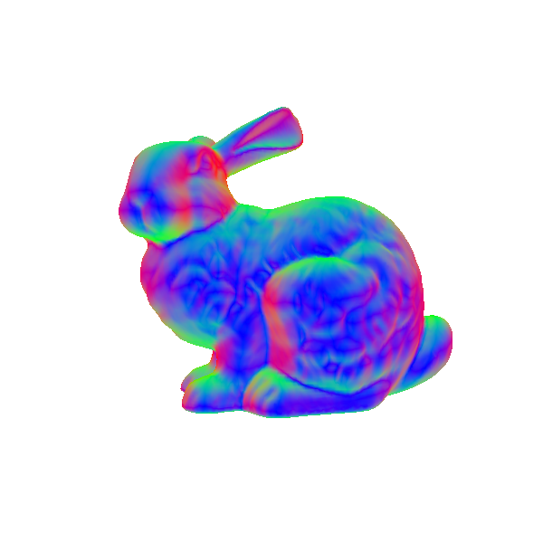

Assignment - Phong Model      {#assignment-phong}
==========================

By the end of this assignment you should see the Bunny with proper Phong Model on your screen.
You will write two shaders, one for Phong Shading, and one for Gouraud Shading.

For this assignment you will get bonus Tucano features:
	* controls for your interface, so you can control the camera and the light direction with your mouse.
	* a GUI with sliders to control the shading parameters. When your shaders are working, the GUI should also work.

For this assignment you will need to complete the *render* method in *shading.hpp*, and shader files: *phongshader.vert*, *phongshader.frag*, *gouraudshader.vert*, *gouraudshader.frag*.

You will be working with two models: **bunny.ply** and a plane (composed by two triangles) that is created in the code.
When you press 'M' you can switch between the two meshes.

In the following assignment you will implement Gouraud and Phong Shading.
When you press 'L' you can switch between using these shaders.

## From GUI to Shaders

Note that the *shading.hpp* file already contain the variables necessary to control your material properties, that is, the ambient, diffuse, and specular parameters (*ka, kd, ks, and shininess*), as well as the light intensity.

Your first task is to extend the render method so that these variables are passed to the shaders as uniforms.
Then, you need also to include these uniforms in your shader (if in the vertex, fragment, or both shaders, it is up to you).

## Warm up (optional, not graded, don't hand in this part)

**This is just a warm up exercise, it will not be graded and you should not hand any solution for this part.** 
You can use either the Gouraud or Phong shader files for this warm up.

The **bunny** mesh already contains normals. Tucano will read them and automatically make them ready through the *in vec in_Normal* variable in the vertex shader.

If you for example render the final fragment color with the *normalized* normal vector you can have a color representation of the normals. However, remember that the normal vectors
may have negative values, and colors should not. Nevertheless, if you set the output color as the absolute normal value:

~~~~
vec4(abs(normal),1.0);
~~~~

you should see the following result:

## Illumination (Phong Shading)

Before we start, here are a few useful GLSL commands that you might need:

* **a** is the normalized **b** vector. Note that **b** remains unchanged.
~~~~~~~~~~~~~~~~
vec4 a = normalize (b);
~~~~~~~~~~~~~~~~

* **c** is vector **a** reflected over vector **b** 
~~~~~~~~~~~~~~~~
vec4 c = reflect (a, b);
~~~~~~~~~~~~~~~~

* you can invert and transpose matrices using the following commands:
~~~~~~~~~~~~~~~~
mat4 my_transposed_matrix = transpose (my_matrix);
mat4 my_inverse_matrix = inverse (my_matrix);
~~~~~~~~~~~~~~~~

The same operations above apply for other vector (vec2, vec3) or matrices (mat2, mat3).

Finally, it is time to implement the Phong Shader. 
One important point is that all your computations must be coherent in terms of space, that is,
all your vectors and points must be in the same space (model, camera, world ...).
The choice is up to you, here we call it **your space** to write the instructions in a generic way.

Here is an overview of the required elements:

1. interpolated normal in **your space**.

2. light vector in **your space**. Don't forget to normalize it!

	Hint: you do not have a light direction, but a light matrix. The default light direction is pointing to the z axis.
	If you transform the vector [0, 0, -1, 0] by the light matrix, you will get the current light direction in **world space**.

3. reflected transformed light vector over the transformed normal.

4. eye vector in **your space**. This is the vector from the 3D position of the fragment to the eye.

	Hint: the 3D position of the fragment can be acquired by interpolating the **non-projected** vertices positions from the vertex space.
	It does not matter if they are in model or camera space, if you do not project them, you will receive a 3D interpolated position in your fragment shader.
	Hint: the eye in **camera space** is the center of the coordinate systems, that is, [0, 0, 0, 1].

5. now you are ready to compute the Phong Shading terms and get your final shaded color for the fragment.

## Illumination (Gouraud Shading)

Even though Gouraud Shading has been mostly replaced by Phong Shading, implementing it will let you compare the result with the Phong Shader.
Furthermore, you will see how inserting the computation at different parts of the pipeline results in different shadings.

For this part of the assignment you will write the gouraudshader.vert and gouraudshader.frag files just as you did with the Phong Shading.
Remember, both Phong and Gouraud Shading follow the Phong Illumination Model, so they need the exactly same parameters.